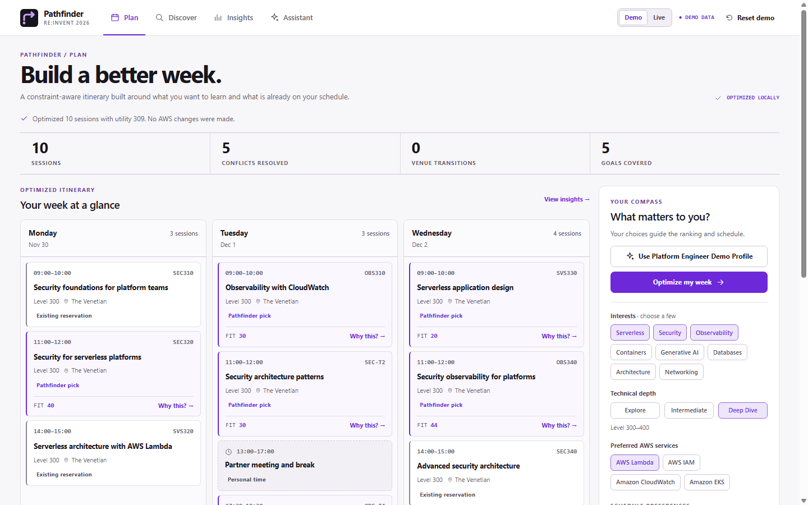
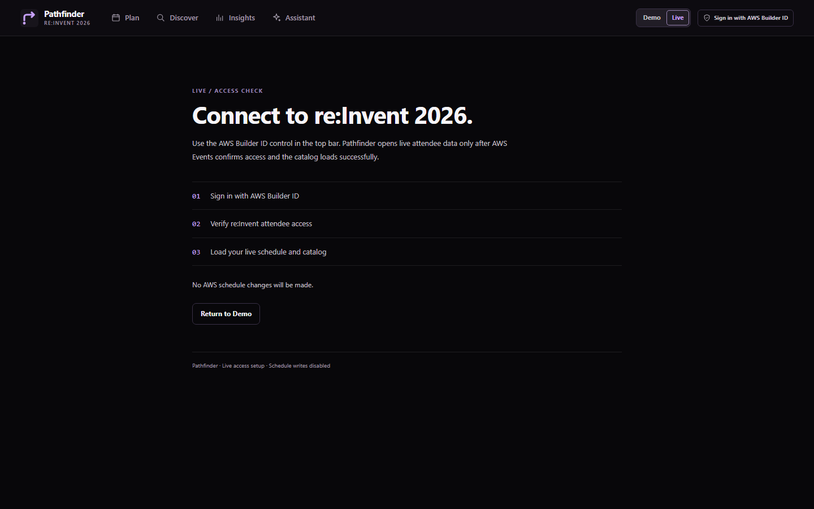

# re:Invent Pathfinder

> Most conference tools help you find sessions. Pathfinder optimizes your entire re:Invent experience.



re:Invent has thousands of possible sessions. Choosing individually relevant
sessions is easy; building a coherent week is harder. Pathfinder treats
conference planning as an optimization problem.

This repository contains the Pathfinder product: FastAPI, AWS Events REST and MCP
adapters, local catalog search, preference ranking, deterministic scheduling,
explanations, existing-schedule integration, safe mutation planning and
verification, and a typed-intent agent. Live attendee validation is pending;
the offline demos use fixtures and fake clients. AWS adapters supply external
data and actions; Pathfinder owns ranking, optimization, and mutation safety.
See the [architecture overview](docs/architecture.md).

## Validation status

The REST and MCP adapters, catalog normalization, schedule integration,
mutation safety, verification, and UI workflows are covered by offline tests
and fake clients.

**Live validation status:** AWS Builder ID OAuth has been validated against
the real AWS Events service. Authentication completed successfully, but
attendee-bound access currently returns the documented registration-required
response because the test Builder ID is not registered for re:Invent 2026.
This test account therefore cannot enter Live data mode; the Demo remains
available. Live mutations remain disabled.

Pathfinder deliberately separates authentication from attendee authorization.
A successful Builder ID sign-in is not enough to enter **Live AWS** mode; an
attendee-bound AWS Events response must also succeed and normalize correctly.
This prevents a successful OAuth flow from being mistaken for event access.
Successful live catalog and GetSchedule reads, MCP attendee operations,
reservations, and cancellations remain unvalidated.

## Run the API

Requires Python 3.13+.

```bash
python -m pip install -e '.[dev]'
uvicorn app.main:app --app-dir apps/api --reload
```

Check `http://127.0.0.1:8000/health`.

## Run the offline product UI

The M9 demo uses a separate fixture catalog, a stateful fake Events client,
and process-local agent context. It needs no AWS, MCP, or LLM credentials.
In two PowerShell terminals:

```powershell
# Terminal 1, repository root
$env:PATHFINDER_DEMO_MODE="true"
$env:AWS_EVENTS_ENABLE_WRITES="false"
uvicorn app.main:app --app-dir apps/api --host 127.0.0.1 --port 8000
```

```powershell
# Terminal 2
cd apps/web
Copy-Item .env.example .env.local
npm install
npm run dev
```

Open `http://127.0.0.1:3000`. Click **Use Platform Engineer Demo Profile**,
then **Optimize my week**. Open **Why this?** and **Insights**, then use
Assistant for **Make Wednesday less busy** and **Replace my Wednesday 2 PM
session with something more advanced about containers**. Review the proposed
changes and click **Confirm demo changes** to see the fake operation result
and verified schedule. **Reset demo** restores the fixture reservations,
profile shortcut, and pending-plan state.

The top-right **Demo | Live** control selects the access flow and theme.
**Demo** is the default: fixture-backed, light Pathfinder theme, and no AWS
credentials required. Demo hides AWS sign-in controls. Selecting **Live** opens
a separate access setup view with the Builder ID control; fixture content is
hidden during this step, and the setup view uses the dark theme:



Actual Live data mode begins only after Builder ID sign-in, a successful attendee-bound
`GetSchedule` read, and a complete live catalog load into a separate local
SQLite database. A Builder ID that is not registered for re:Invent 2026 stays
out of Live data mode with a clear notice. Completing a mode switch clears
pending mutation plans. Live Assistant and Discover use the separate live
catalog; live schedule writes remain disabled. Selecting
Live never changes `AWS_EVENTS_ENABLE_WRITES=false`.

With both servers running, `python scripts/smoke_ui.py` checks the complete
offline HTTP flow through Next.js and FastAPI, including reset.

The purple **Demo data** label identifies fixture state. The demo endpoints
are unavailable unless `PATHFINDER_DEMO_MODE=true`; they use
`data/demo_catalog.sqlite3` unless `PATHFINDER_CATALOG_DB` is set. Demo planning
does not use live AWS. The optional local Live bridge stores a completed live
catalog in the separate ignored `data/live_catalog.sqlite3` file. The HTTP API
has no attendee authentication, so the local `conversation_id` is not an
authorization mechanism. Live writes remain
disabled by default and must not be enabled on an exposed deployment.

The compact **Sign in with AWS Builder ID** control appears after selecting
Live and uses the existing local OAuth/PKCE helper. Clicking it opens AWS
sign-in in the attendee's browser, keeps the access token only in that API
process, and performs a read-only
`GetSchedule` access check. The status can show that Builder ID is connected
while re:Invent registration is still required. Returning to Demo after sign-in
shows **Demo data** again; sign-in alone never changes the data source. This
local control is restricted to loopback access; it does not make the UI an
attendee-authenticated deployment
or enable AWS schedule writes.
If the browser blocks the new tab, use **Open sign-in page** in the top bar.
Enter Builder ID credentials only on the AWS sign-in page; Pathfinder never
asks for a password or token.

## Sync the catalog

Register for re:Invent 2026, then sign in locally with AWS Builder ID:

```bash
python scripts/sync_catalog.py --login
```

This opens your default browser and listens only on `127.0.0.1` at an AWS
Events callback port (8484-8489). The access token stays in memory for that
sync. No refresh token or token file is stored.

If you already have an AWS Events access token, set `AWS_EVENTS_ACCESS_TOKEN`
in your environment and run the command without `--login`:

```bash
python scripts/sync_catalog.py
```

`--login` takes precedence if both are available. `.env.example` lists the
configuration names; the script does not load `.env` automatically.

The command treats a completed page walk as one catalog generation: it upserts
observed sessions into `data/catalog.sqlite3` and removes IDs absent from that
generation in one SQLite transaction. It also writes `data/catalog.json` as a
debugging export. Malformed individual sessions are skipped and counted. If an
entry still has a valid ID, its last known-good local row is retained. An API
or network error stops the sync before changing the local catalog. Set
`PATHFINDER_CATALOG_DB` to use a different SQLite path.

If a live sync returns HTTP 403, the command recognizes a registration-related
JSON message, reports other JSON denials generically, and distinguishes an
empty edge refusal without showing the response body. AWS requires event
registration under the same Builder ID used for sign-in; another login does
not fix missing registration.

Live `reinvent2026` synchronization is **pending external validation** because
it requires a registered attendee account. Local development and tests use
fixtures and `FakeEventsClient`.

## Search the local catalog

Start the API, then query the local SQLite catalog:

```text
GET /sessions/search?query=advanced%20serverless%20observability&level=300&level=400&service=AWS%20Lambda
```

Repeat `level`, `session_type`, `service`, `topic`, or `track` for multiple values,
or separate values with commas. Values within a filter are alternatives; all
specified filter types must match. An empty query returns catalog sessions
sorted by title. Results include scores, matched terms, and field score details.
Search reads SQLite only and does not call AWS.

## Recommend with an attendee profile

Send a structured profile to `POST /sessions/recommend`:

```json
{
  "query": "serverless architecture",
  "profile": {
    "interests": ["serverless", "security"],
    "preferred_services": ["AWS Lambda"],
    "desired_levels": ["300", "400"],
    "prioritize_depth": true
  },
  "filters": {"levels": ["300", "400"]},
  "limit": 10
}
```

The profile is optional for local search. Recommendations return the original
text relevance score, a separate preference score, matched preferences,
bonuses, penalties, and their final sum. Text scoring remains title 12,
service/topic 8, track/role 5, abstract 2, and speaker 1 per matched query
term, using the strongest field for each term. Preference scoring adds up to
two interest matches at 4 each, one preferred service at 5, one preferred
topic at 4, desired level at 3, preferred session type at 3, and up to two
learning goals at 4 each. An avoided level subtracts 6. Depth adds 3 for an
explicit level 400 or 1 for level 300. Missing and introductory levels add 0.
Final score is text score plus preference score; ties use title, then ID.
Query terms still determine which sessions are eligible when a query is given.

`blocked_times`, `max_sessions_per_day`, `minimize_venue_changes`, and
`diversity_weight` are validated profile fields. M3 ranking does not use
them. M4 uses blocked times, daily maximum, and venue minimization;
`diversity_weight` remains reserved for a later milestone.

Compare three fixture personas without AWS credentials:

```bash
python scripts/demo_personas.py
```

## Optimize a local itinerary

Send the same query/profile context to `POST /schedule/optimize`. Optional
`fixed_sessions` are normalized `Session` objects; `candidate_limit` defaults
to 150 and can be set from 1 to 500. Optional `event_start` and `event_end`
use ISO dates. The endpoint searches local SQLite, then globally optimizes
the ranked candidates within each independent day. It returns selected and
rejected sessions, reasons, alternatives, score, venue transitions, and daily
counts. See [optimizer design](docs/optimizer.md) for the objective and limits.

```json
{
  "query": "serverless security observability",
  "profile": {
    "interests": ["serverless", "security", "observability"],
    "blocked_times": [
      {"day": "Tuesday", "start": "13:00", "end": "17:00"}
    ],
    "max_sessions_per_day": 5,
    "minimize_venue_changes": true
  },
  "fixed_sessions": [],
  "candidate_limit": 150
}
```

Run the two-day fixture demo without AWS credentials:

```bash
python scripts/demo_optimizer.py
```

For structured reasons, schedule insights, and relative interest/learning-goal
coverage, send the same request body to `POST /schedule/explain`. Its response
contains both the unchanged optimized schedule and an `explanation` object.
See [explainability design](docs/explainability.md) for the coverage formula
and limits. Run its offline demo with:

```bash
python scripts/demo_explanations.py
```

## Optimize around an existing attendee schedule

`POST /schedule/optimize-existing` accepts a normalized `existing_schedule`
with `reserved_session_ids`, `favorite_session_ids`, and `personal_time`, plus
the same `query`, `profile`, and `filters` used by local optimization. It
resolves reserved IDs from local SQLite, preserves them as fixed sessions,
blocks personal time, and recommends sessions in the remaining gaps. The
response labels each selected session `existing_reserved` or
`pathfinder_selected`, labels personal time separately, and includes the
optimized schedule and explanations. The endpoint makes no AWS call.

Run the offline fixture demo with:

```bash
python scripts/demo_existing_schedule.py
```

See [schedule integration](docs/schedule-integration.md) for the AWS response
mapping, provenance, and current limitations. Live AWS schedule validation is
pending registered re:Invent 2026 attendee access.

## Preview and verify schedule changes

`POST /schedule/mutations/plan` compares the current normalized attendee
schedule with an optimized schedule and returns additions, explicit removals,
unchanged reservations, and replacements without writing anything.
`POST /schedule/mutations/execute` requires the returned plan and
`confirmed: true`. Live writes are disabled by default via
`AWS_EVENTS_ENABLE_WRITES=false`; tests inject a fake client.

```bash
python scripts/demo_mutations.py
```

See [mutation safety and verification](docs/mutations.md) for batching,
partial-success handling, replacement ordering, and the live-access limit.

## Try the offline natural-language agent

`POST /agent/message` accepts a message and `conversation_id`. Its in-memory
context holds a typed profile, the latest itinerary, and at most one pending
mutation plan. The agent parses structured intents, then invokes the existing
local search, optimizer, explanation, and M7 mutation services. The default
parser is deterministic and needs no LLM credentials.

```bash
python scripts/demo_agent.py
```

The demo includes a profile request, a lighter Wednesday, a replacement plan,
explicit confirmation, and GetSchedule verification using fakes. See
[agent design](docs/agent.md) and [MCP integration](docs/mcp-integration.md).
Live AWS REST/MCP attendee validation remains pending because this Builder ID
is not registered for re:Invent 2026. Live reservation/cancellation validation
is separately date/access gated. The API's in-memory agent conversations and
mutation endpoint have no attendee authentication; keep live writes disabled
until an authenticated, attendee-bound API boundary exists.

For a credential-free fixture demo that uses a temporary SQLite database:

```bash
python scripts/demo_search.py
```

## Checks

```bash
pytest
ruff check .
ruff format --check .
cd apps/web && npm test && npm run build
```

`apps/web` is the Next.js product UI; the offline startup steps above run it
with the FastAPI backend.

## License

Pathfinder is released under the [MIT License](LICENSE).

AWS Events REST documentation: [ListSessions](https://docs.aws.amazon.com/events/latest/devguide/rest-op-listsessions.html),
[authentication](https://docs.aws.amazon.com/events/latest/devguide/authentication.html).
The local login follows the [AWS Events PKCE sign-in instructions](https://docs.aws.amazon.com/events/latest/devguide/auth-signing-in.html).
