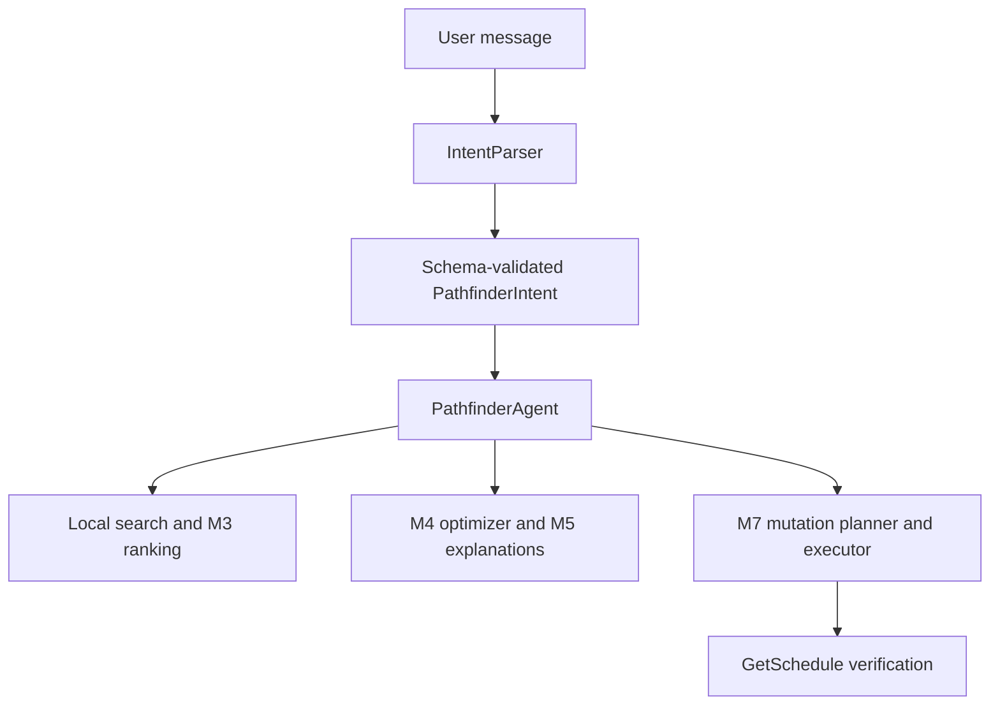

# M8 natural-language Pathfinder agent

## Data flow

`PathfinderAgent` dispatches typed intents to the existing services. It never
calculates relevance, chooses a schedule outside M4, interprets HTTP/MCP
responses as schedule truth, or writes directly. The supported intent models
are `SearchSessions`, `RecommendSessions`, `OptimizeSchedule`,
`ExplainSession`, `ExplainSchedule`, `SuggestReplacement`,
`PlanScheduleMutation`, `ConfirmScheduleMutation`, `DiscardScheduleMutation`, `SetProfile`,
`RefineProfile`, and `ReoptimizeSchedule`. Intent fields are validated with a
discriminated Pydantic union; unknown kinds and extra executable fields fail.

`FakeIntentParser` recognizes a small documented set of phrases and accepts
scripted typed intents for tests. It is a deterministic offline parser, not a
general natural-language model. `SchemaIntentParser` is an optional provider
boundary: a future LLM provider returns structured data, which is validated
before dispatch. No provider is configured by default. The provider receives
only a minimal context hint (interests, latest-schedule presence, pending plan
ID), not bearer tokens or raw schedule content. Invalid provider output causes
no action.

## Conversation state and refinement

`AgentContext` holds the typed `AttendeeProfile`, normalized attendee schedule,
latest M4 itinerary and M5 explanation, last query, date-specific daily limits,
focused session ID, and at most one pending M7 plan. `/agent/message` stores
contexts in process memory by `conversation_id`; this is suitable for the
offline demo, not durable or shared across server processes.

Profile creation uses the existing `AttendeeProfile` schema. A request to make
one day lighter sets a date-specific hard limit and calls the existing M4
optimizer again through `ExistingSchedulePlanner`. It does not rewrite session
scores or remove sessions by hand. Depth and topic follow-ups update profile
preferences, then rerank and reoptimize. An ambiguous session reference does
not produce a mutation plan.

Replacement search uses M3-ranked local candidates near the referenced
session, checks each candidate through M4 with other reserved sessions fixed,
then asks M7 to build the explicit replacement plan. This first version
considers candidates within two hours on the same day and prefers a
nonoverlapping option that can be reserved before releasing the old seat.
Those are proposal-selection rules, not AWS mutations. M7 still validates
the plan and enforces its confirmation and verification policy.

## Confirmation boundary

Every pending plan has an ID containing a conversation-local version and a
SHA-256 digest of the plan's canonical content. The ID is an identity check,
not an authorization secret. A confirmation intent must name the current
pending ID exactly. A bare “Do it” without one returns `needs_context` and
does no reads or writes. A wrong ID also performs no writes. New profile or
schedule input clears the pending plan. M7 reads GetSchedule before writing;
if the attendee schedule changed, execution returns `stale_plan` with zero
writes. After an execution attempt, the pending plan is cleared, and any
verified GetSchedule result updates conversation state.
The agent recomputes the plan digest at confirmation, so changes to the
reviewed plan invalidate it even if its stored ID was not updated.

The orchestrator also requires explicit confirmation wording independently
of the parser result. A schema-valid model output that claims confirmation
for an unrelated user message is rejected before M7 is called.

The in-memory `conversation_id` is a lookup key, not an authorization secret.
The API currently has no attendee identity binding, so it must remain a local
or otherwise access-controlled demo surface until authenticated sessions are
added. Live writes stay disabled by default.

The response includes the typed intent name, deterministic service invoked,
structured data, concise message, and pending plan ID where applicable.
Generated prose is never used as application state. Live writes remain off
unless the explicit M7 write flag and a configured client allow them.

Run `python scripts/demo_agent.py` for a credential-free multi-turn scenario.
This milestone does not require an LLM or AWS attendee account.
