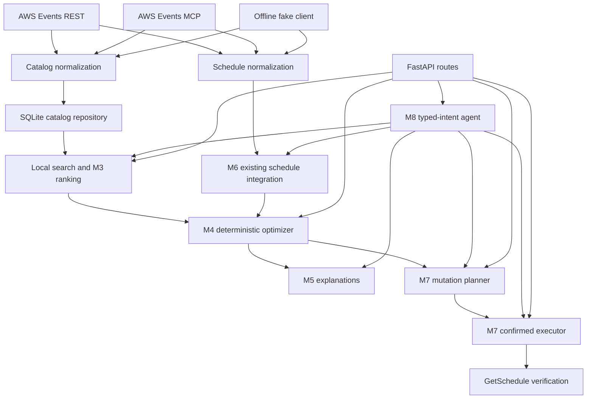

# Current architecture (M0–M9)

Core ranking, time constraints, optimization, and explanations are independent
of FastAPI, SQLite, OAuth, and AWS transport schemas. REST and MCP adapters
only supply catalog/schedule data and execute explicitly authorized operations.
The OAuth helper is separate from the REST client. The catalog sync completes
the upstream walk before atomically replacing the SQLite generation; an
all-malformed generation also preserves the last known-good catalog.

The API's agent context is process-local and keyed by `conversation_id`.
It is suitable for offline demonstration, not authenticated multi-user use.
Live writes are disabled by default. See [mutation safety](mutations.md) and
[agent boundaries](agent.md) before deploying a write-enabled API.
M9's explicit demo mode seeds a separate fixture SQLite catalog and uses a
stateful fake Events client; reset restores that fake and clears conversations.

Live AWS REST/MCP attendee validation remains pending because this Builder ID
is not registered for re:Invent 2026. Live reservation/cancellation validation
is separately date/access gated.
