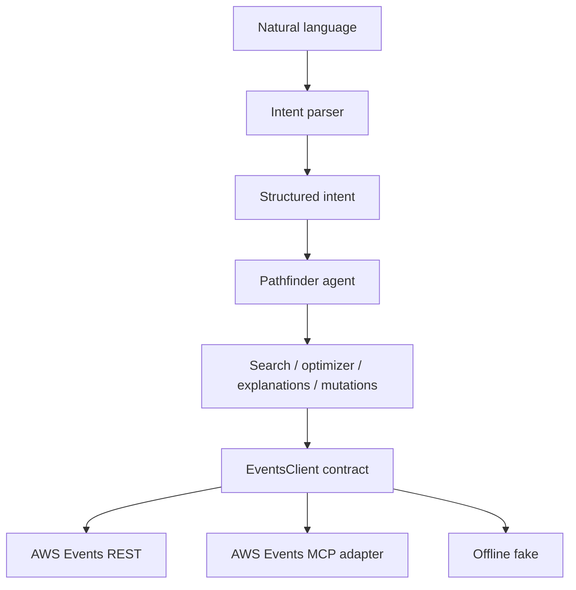

# M8 AWS Events MCP transport boundary

The [AWS Events MCP documentation](https://docs.aws.amazon.com/events/latest/devguide/mcp-server.html)
publishes the remote endpoint `https://api.awsevents.com/mcp` and the tool
names `ListSessions`, `GetSession`, `GetSchedule`, `ReserveSessions`, and
`CancelReservation` (among others). The server uses streamable HTTP and
requires sign-in even for catalog reads. Pathfinder's `AwsEventsMcpClient`
maps those fixed tools to the same `EventsClient` operations as the REST
client. Catalog sync, local search, M3 ranking, M4 optimization, M5
explanations, and M7 mutation policy do not know which transport supplied the
data.

The MCP adapter accepts a narrow `McpToolInvoker` instead of arbitrary tool
names. `SdkMcpToolInvoker` wraps an already initialized, authenticated MCP SDK
session supplied by the application. Before the first call it reads the
server's advertised `tools/list` definitions and checks the required input
keys for each tool before calling it. A read still works when unavailable
write tools are omitted. AWS's public MCP guide publishes tool names but
does not expose the live `tools/list` schemas without attendee access. The
expected arguments follow the corresponding published REST/OpenAPI operation
parameters: `eventId`, `sessionId`, `sessionIds`, and `nextToken`. If the live
advertised schemas differ, the adapter fails closed before a tool call; the
mapping must then be updated against authenticated discovery.

`ListSessions` pagination continues until `nextToken` is absent. GetSchedule
is normalized through the M6 adapter. Reservation results use the same M7
per-session parser as REST. MCP writes are disabled by default and are still
subject to M7 explicit confirmation, batching, stale-plan checks, and
GetSchedule verification. The adapter does not expose arbitrary MCP methods
to the agent. Favorites and personal time remain readable through
GetSchedule; M8 adds no write tools for them.
`GetSession` validates the returned session and its requested ID before
returning raw transport data; malformed GetSchedule responses raise a typed
MCP transport error.

`FakeMcpToolInvoker` simulates pages, schedules, partial reservation results,
malformed output, and tool failures. Offline tests also run an MCP-sourced
catalog through the existing SQLite sync and an MCP-backed partial mutation
through the M7 executor. No real MCP connection, attendee credentials, or
live reservation was used.

Live AWS REST/MCP attendee validation remains pending because this Builder ID
is not registered for re:Invent 2026. Live MCP tool discovery and operations
have not been validated; live reservation/cancellation validation is separately
date/access gated.
